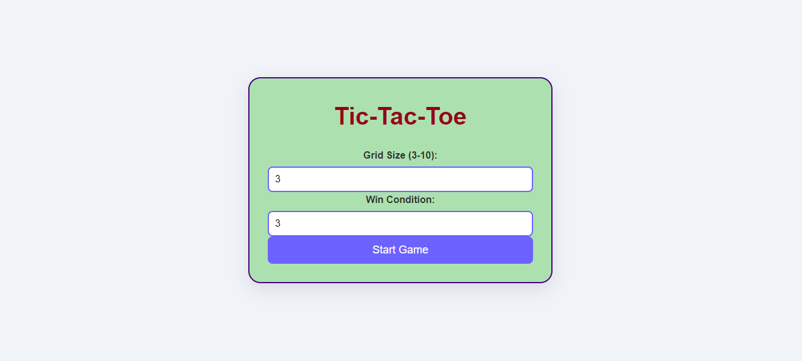
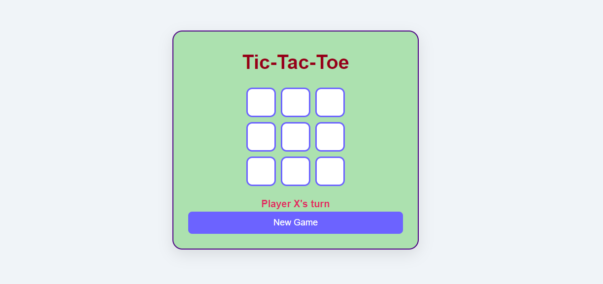

# Customizable Tic-Tac-Toe Game

Welcome to the Customizable Tic-Tac-Toe Game! This project is a dynamic web application that allows users to play Tic-Tac-Toe on a customizable grid size and win condition.

## Table of Contents
- [Features](#features)
- [Technologies Used](#technologies-used)
- [How to Run the Project](#how-to-run-the-project)
- [Gameplay Instructions](#gameplay-instructions)
- [Code Structure](#code-structure)


## Features
- Customizable grid size (3x3 to 10x10)
- Customizable win condition (from 3 to grid size)
- Responsive design for different screen sizes
- Attractive UI with CSS animations
- Displays win or draw messages

## Technologies Used
- HTML
- CSS (with CSS Variables)
- JavaScript

## How to Run the Project
1. Clone the repository:
   ```bash
   git clone https://github.com/APrakashzb07/Custom-Tic-Tac-Toe

2. Navigate to the project directory:
   cd tic-tac-toe

3. Open index.html in your web browser.

## Gameplay Instructions

1. Enter your desired grid size (between 3 and 10) and win condition (between 3 and the grid size).
2. Click "Start Game" to begin.
3. Players take turns clicking on the cells to place their marks ('X' or 'O').
4. The game ends when a player wins or when there is a draw.
5. Click "Reset Game" to start a new game.

## Code Structure

1. index.html: The main HTML file containing the structure of the game.
2. style.css: The stylesheet for the game, including styles for the layout and animations.
3. script.js: The JavaScript file that handles the game logic and user interactions.




